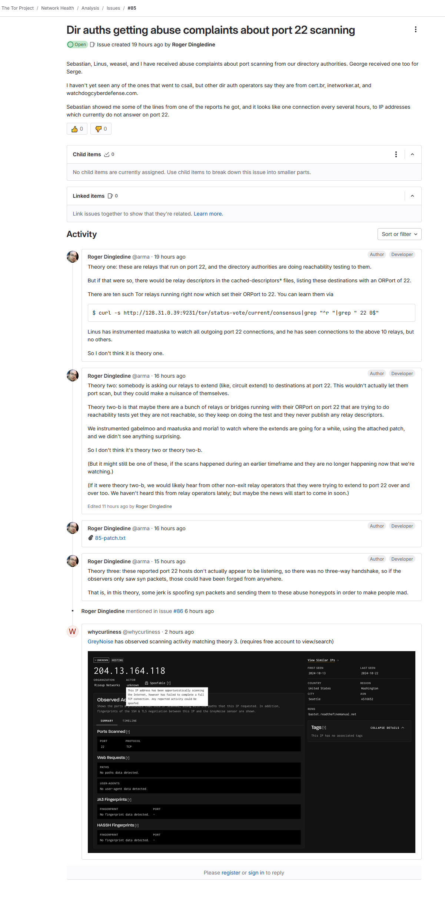
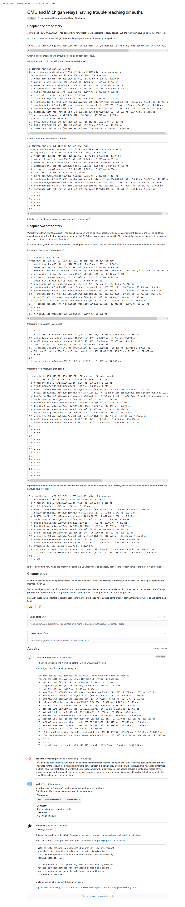

## Hi there 🖕

⚠️ When Tor can Abuse, we can also Abuse Tor! ⚠️

```
 █████╗ ██████╗ ██╗   ██╗███████╗███████╗████████╗ ██████╗ ██████╗ 
██╔══██╗██╔══██╗██║   ██║██╔════╝██╔════╝╚══██╔══╝██╔═══██╗██╔══██╗
███████║██████╔╝██║   ██║███████╗█████╗     ██║   ██║   ██║██████╔╝
██╔══██║██╔══██╗██║   ██║╚════██║██╔══╝     ██║   ██║   ██║██╔══██╗
██║  ██║██████╔╝╚██████╔╝███████║███████╗   ██║   ╚██████╔╝██║  ██║
╚═╝  ╚═╝╚═════╝  ╚═════╝ ╚══════╝╚══════╝   ╚═╝    ╚═════╝ ╚═╝  ╚═╝

CMU and Michigan relays having trouble reaching dir auths:
https://gitlab.torproject.org/tpo/network-health/analysis/-/issues/86

Dir auths getting abuse complaints about port 22 scanning:
https://gitlab.torproject.org/tpo/network-health/analysis/-/issues/85

Archived as images:



```
